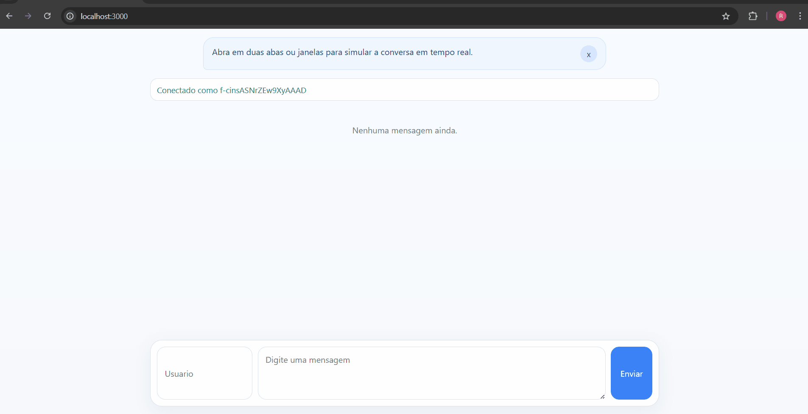

# Chat em Tempo Real com NestJS

POC simples para explorar conceitos de chat em tempo real com NestJS, WebSockets e organização por feature.

O foco aqui não é construir um produto completo, e sim validar a base técnica:
- comunicação em tempo real com Socket.IO
- fluxo HTTP + WebSocket
- organização por módulos no NestJS
- arquitetura por feature
- uso opcional de Redis para pub/sub

## Demonstração


## Stack

- NestJS
- TypeScript
- Socket.IO
- Redis Adapter para Socket.IO
- ESLint + Prettier

## Como a aplicação foi organizada

O projeto segue uma estrutura simples por feature:

```text
src/
  app.module.ts
  main.ts
  chat/
    chat.module.ts
    chat.controller.ts
    chat.service.ts
    chat.gateway.ts
    dto/
      send-message.dto.ts
    interfaces/
      chat-message.interface.ts
```

### Papel de cada parte

- `ChatController`: expõe endpoints HTTP para listar e enviar mensagens.
- `ChatService`: centraliza a regra da feature e armazena as mensagens em memória.
- `ChatGateway`: recebe e publica eventos em tempo real via Socket.IO.
- `ChatModule`: agrupa a feature `chat`.
- `AppModule`: módulo raiz da aplicação.

Essa separação deixa claro o fluxo da POC:

`Controller -> Service -> Gateway`

e também:

`Gateway -> Service -> Gateway`

## Página de teste

Existe uma página simples em `public/index.html` para testar a conversa manualmente no navegador.

Ela serve para:
- abrir duas abas ou janelas e simular usuários diferentes
- visualizar o histórico carregado via HTTP
- enviar e receber mensagens em tempo real via WebSocket

Ao iniciar a aplicação, basta acessar:

```text
http://localhost:3000
```

## Como rodar localmente

### 1. Instalar dependências

```bash
npm install
```

### 2. Subir a aplicação

Modo normal:

```bash
npm run start
```

Modo desenvolvimento com reload:

```bash
npm run start:dev
```

Se quiser acompanhar alterações em tempo real durante o desenvolvimento, use `npm run start:dev`.

## Como testar

1. Execute a aplicação.
2. Abra `http://localhost:3000`.
3. Abra a mesma página em duas abas.
4. Informe um usuário em cada aba.
5. Envie mensagens e observe o broadcast em tempo real.

## Redis

O projeto já possui base para uso de Redis com o adapter de Socket.IO.

Na POC, isso é opcional. A ideia é permitir evoluir o experimento para cenários com múltiplas instâncias da aplicação e pub/sub entre elas.

## Objetivo da POC

Validar conceitos técnicos com uma implementação pequena, clara e fácil de evoluir:
- WebSockets no NestJS
- eventos em tempo real
- modularização
- arquitetura por feature
- integração opcional com Redis

## Conhecimentos adquiridos

- Melhor entendimento do protocolo WebSocket e de como ele difere do HTTP, principalmente pela manutenção da conexão e pela comunicação bidirecional em tempo real.
- Compreensão de como o Redis pode ser usado com Socket.IO em um cenário de pub/sub, facilitando a troca de eventos entre múltiplas instâncias da aplicação.
- Evolução na adaptação de conceitos já conhecidos em outras linguagens e frameworks para o ecossistema do NestJS, especialmente em modularização, serviços e gateways.
